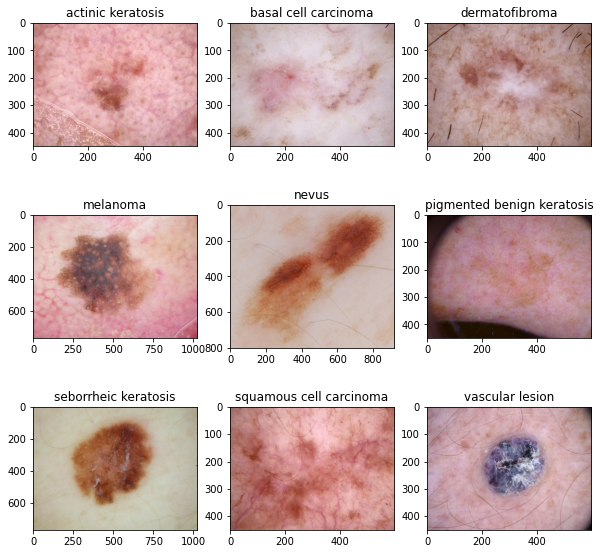
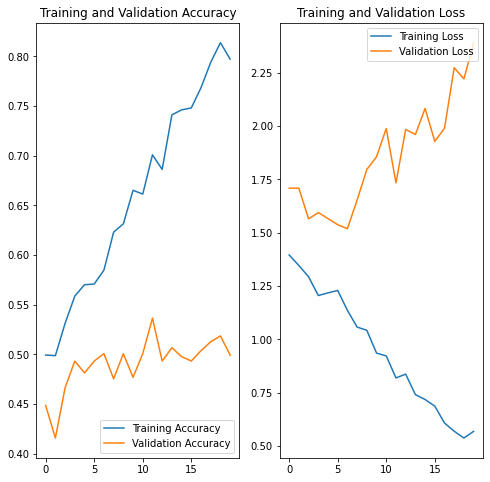
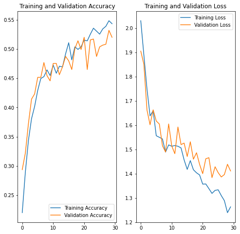
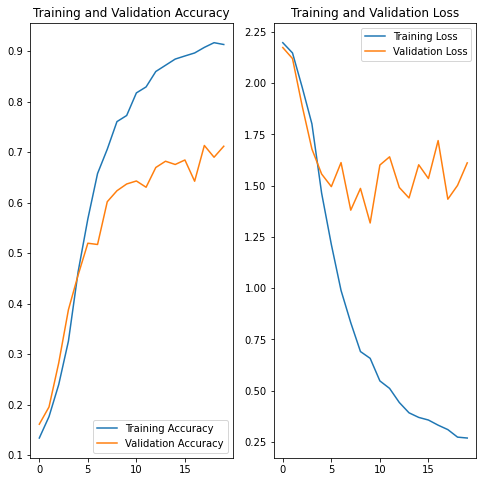

# Melanoma-Cancer-Detection-

## Table of Contents
* [Problem Statement](#problem-statement)
* [Objective](objective)
* [Data Description ](#data-description)
* [Dataset Visualisation](#dataset-visualisation)
* [Observations](#observations)
* [Conclusions](#conclusions)
* [Technologies Used](#technologies-used)

<!-- You can include any other section that is pertinent to your problem -->

## Problem Statement
To build a CNN based model which can accurately detect melanoma. Melanoma is a type of cancer that can be deadly if not detected early. It accounts for 75% of skin cancer deaths. A solution that can evaluate images and alert dermatologists about the presence of melanoma has the potential to reduce a lot of manual effort needed in diagnosis.

## Objective
Building a multiclass classification model using a custom CNN in TensorFlow

## Data Description 
The dataset consists of 2357 images of malignant and benign oncological diseases, which were formed from the International Skin Imaging Collaboration (ISIC). All images were sorted according to the classification taken with ISIC, and all subsets were divided into the same number of images, with the exception of melanomas and moles, whose images are slightly dominant.

The data set contains the following diseases:
1. Actinic keratosis
2. Basal cell carcinoma
3. Dermatofibroma
4. Melanoma
5. Nevus
6. Pigmented benign keratosis
7. Seborrheic keratosis
8. Squamous cell carcinoma
9. Vascular lesion

Dataset link: https://drive.google.com/file/d/1xLfSQUGDl8ezNNbUkpuHOYvSpTyxVhCs/

## Dataset Visualisation

## Observations
### Model Result with optimizer adam, activation function softmax and Epoch =20

#### There is overfitting observed in the model as validation accuracy decreases while train accuracy increases around 17th epoch

### Model Result with same parameters after data augmentation

#### Overfitting and loss both reduce in this model

### Model build after rectified class imbalance data

#### Test and Validation both Accuracy increased after using augmentor 

## Conclusions
- Adding augmented images helped in handling class imblance.
- Model trained accuracy increased to above 70% and validation above 65%
- Till first 15 epocs learning rate is very high then validation accuracy decreases while train accuracy still increases for some epochs

## Technologies Used
- tensorflow  - version 2.6.4
- python - version 3.10
- Augmentor - version 0.2.10
- Used Kaggle environment with GPU100

<!-- As the libraries versions keep on changing, it is recommended to mention the version of library used in this project -->

## Contact
Created by [@gautampoddar18] 

<!-- Optional -->
<!-- ## License -->
<!-- This project is open source and available under the [... License](). -->

<!-- You don't have to include all sections - just the one's relevant to your project -->
